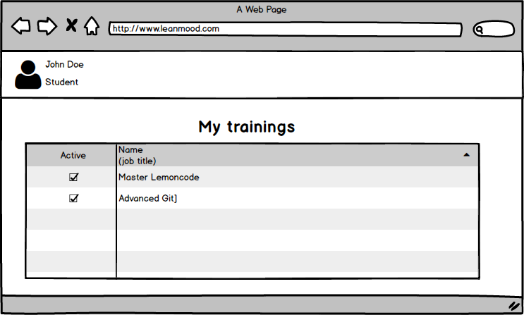

# Student Trainings Mock

This repo contains the mockup of the student training page.
The first task of the module 01 (layout) of [Master Front-End Lemoncode](http://www.formacion.lemoncode.net/master-frontend).

We'll start from the next low-fidelity mockup:

The idea behind this project is create a web page using html5, css, sass and bootstrap that implements that mockup.
